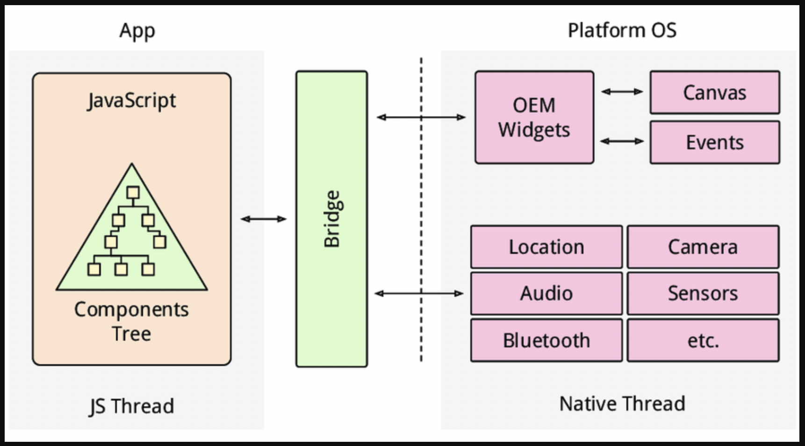

# React Native Bridging

### React Native Concepts


[Native Modules Intro · React Native](https://reactnative.dev/docs/0.68/native-modules-intro)

### React Native Bridging Diagram



### IOS Bridging

[iOS Native Modules · React Native](https://reactnative.dev/docs/0.68/native-modules-ios)

1. The first step is to create our main custom native module header and implementation files. Create a new file called `RCTCalendarModule.h` and add the following to it:
    
    ```objectivec
    //  RCTCalendarModule.h
    #import <React/RCTBridgeModule.h>
    @interface RCTCalendarModule : NSObject <RCTBridgeModule>
    @end
    ```
    
    <aside>
    💡 ObjC does not have language-level support for namespaces like Java or C++, so the convention is to prepend the class name with a substring. This could be an abbreviation of your application name or your infra name. RCT, in this example, refers to React.
    
    </aside>
    
2. Next up, let’s start implementing the native module. Create the corresponding implementation file, `RCTCalendarModule.m`, in the same folder and include the following content:
    
    ```objectivec
    // RCTCalendarModule.m
    #import "RCTCalendarModule.h"
    
    @implementation RCTCalendarModule
    
    // To export a module named RCTCalendarModule
    RCT_EXPORT_MODULE();
    
    @end
    ```
    
3. Copy toast library and  implement `UIView+Toast.h` & `UIView+Toast.m`
4. Add and implement at `RCTCalendarModule.m`
    
    ```objectivec
    //
    //  RCTCalendarModule.m
    //  RnBridgingIos
    //
    //  Created by Andika Andriana on 06/09/22.
    //
    
    #import <Foundation/Foundation.h>
    // RCTCalendarModule.m
    #import "RCTCalendarModule.h"
    #import <React/RCTLog.h>
    #import "UIView+Toast.h"
    
    NSInteger const LRDRCTSimpleToastBottomOffset = 40;
    double const LRDRCTSimpleToastShortDuration = 3.0;
    double const LRDRCTSimpleToastLongDuration = 5.0;
    NSInteger const LRDRCTSimpleToastGravityBottom = 1;
    NSInteger const LRDRCTSimpleToastGravityCenter = 2;
    NSInteger const LRDRCTSimpleToastGravityTop = 3;
    
    @implementation RCTCalendarModule{
      CGFloat _keyOffset;
    }
    
    + (BOOL)requiresMainQueueSetup
    {
        return NO;
    }
    
    // To export a module named RCTCalendarModule
    RCT_EXPORT_MODULE();
    
    - (NSDictionary *)constantsToExport {
        return @{
                 @"SHORT": [NSNumber numberWithDouble:LRDRCTSimpleToastShortDuration],
                 @"LONG": [NSNumber numberWithDouble:LRDRCTSimpleToastLongDuration],
                 @"BOTTOM": [NSNumber numberWithInteger:LRDRCTSimpleToastGravityBottom],
                 @"CENTER": [NSNumber numberWithInteger:LRDRCTSimpleToastGravityCenter],
                 @"TOP": [NSNumber numberWithInteger:LRDRCTSimpleToastGravityTop]
                 };
    }
    
    RCT_EXPORT_METHOD(createCalendarEvent:(NSString *)message)
    {
          
      [self _show:message duration: 0.5 gravity:LRDRCTSimpleToastGravityBottom];
    
    }
    
    - (void)_show:(NSString *)msg duration:(NSTimeInterval)duration gravity:(NSInteger)gravity {
        dispatch_async(dispatch_get_main_queue(), ^{
            UIView *root = [[[[[UIApplication sharedApplication] delegate] window] rootViewController] view];
            CGRect bound = root.bounds;
          bound.size.height -= self->_keyOffset;
            if (bound.size.height > LRDRCTSimpleToastBottomOffset*2) {
                bound.origin.y += LRDRCTSimpleToastBottomOffset;
                bound.size.height -= LRDRCTSimpleToastBottomOffset*2;
            }
            UIView *view = [[UIView alloc] initWithFrame:bound];
            view.userInteractionEnabled = NO;
            [root addSubview:view];
            UIView __weak *blockView = view;
            id position;
            if (gravity == LRDRCTSimpleToastGravityTop) {
                position = CSToastPositionTop;
            } else if (gravity == LRDRCTSimpleToastGravityCenter) {
                position = CSToastPositionCenter;
            } else {
                position = CSToastPositionBottom;
            }
            [view makeToast:msg
                duration:duration
                position:position
                title:nil
                image:nil
                style:nil
                completion:^(BOOL didTap) {
                    [blockView removeFromSuperview];
                }];
        });
    }
    
    @end
    ```
    
5. Create exporter
    
    ```jsx
    /**
    * This exposes the native CalendarModule module as a JS module. This has a
    * function 'createCalendarEvent' which takes the following parameters:
    
    * 1. String name: A string representing the name of the event
    * 2. String location: A string representing the location of the event
    */
    import { NativeModules } from 'react-native';
    const { CalendarModule } = NativeModules;
    export default CalendarModule;
    ```
    
6. Use it on JS
    
    ```jsx
    const onPress = () => {
        CalendarModule.createCalendarEvent('Test 😃');
      };
    ```
